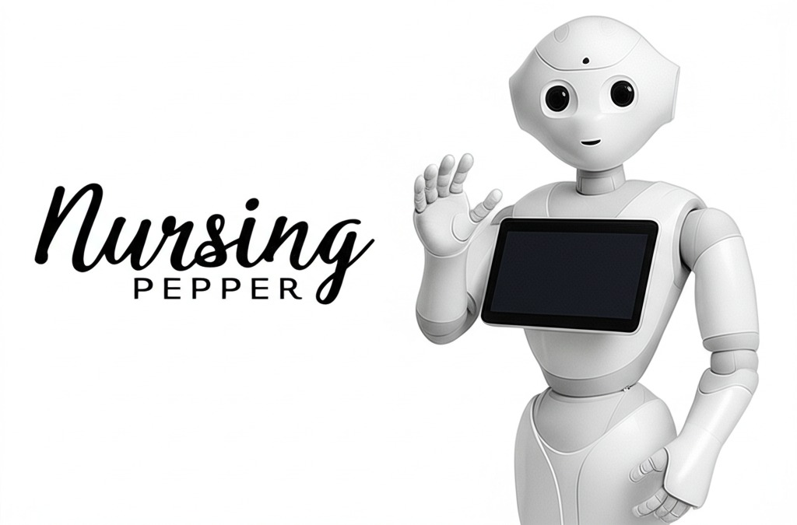

# Nursing Pepper: A Human-Robot Interaction System for Nursing Care

Nursing Pepper is a research project that aims to develop a human-robot interaction system using the Pepper robot to assist in nursing care. The project focuses on creating a system that can understand and respond to the needs of patients and healthcare professionals in a nursing context.



## How to Run

1. Clone the repository and set as working directory:
```bash
git clone
cd nursing_pepper
```

2. Build the Docker image and run the container:
```bash
cd docker
./build.bash
./run.bash
```

3. In another terminal, run the following command to open the container tmux session:
```bash
cd docker
./open_terminal.bash
```

4. In the tmux session, you can run the following command to start the Pepper Human-Robot Interaction system:
```bash
cd start_scripts
./start_all.sh
```

This will start, in parallel, the following components:
- `naoqi`: The NAOqi framework for the Pepper robot, simulates a Pepper robot.
- `choregraphe`: The Choregraphe application for visualization porposes.
- `MODIM`: The MODIM (Multi-mODal Interaction Manager) module, which is responsible for managing the interaction between the robot and the user.
- `rdf.py`: The script that starts the interaction with the robot and handles the communication between the robot and the user, uses console to select the what the virtual sensors of the robot will receive.